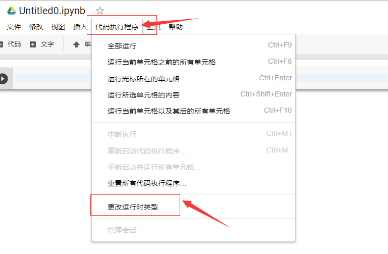
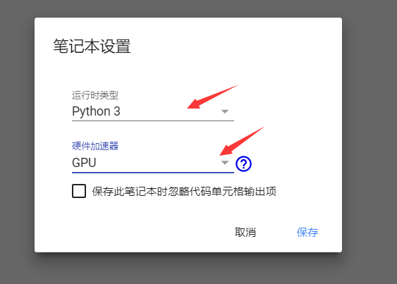

# Colab之GPU

## 0.新项目

谷歌driver里面新建Colab文件，如下图所示：


如何设置GPU？

选择diam执行程序->更改运行时类型为GPU






## 1.验证GPU

查看是否为GPU设备

```python
import tensorflow as tf
tf.test.gpu_device_name() # 查看设备名字
```

查看显卡情况

```
!/opt/bin/nvidia-smi # 查看显卡情况
```

输出：

```
Thu Nov 22 02:08:31 2018       
+-----------------------------------------------------------------------------+
| NVIDIA-SMI 396.44                 Driver Version: 396.44                    |
|-------------------------------+----------------------+----------------------+
| GPU  Name        Persistence-M| Bus-Id        Disp.A | Volatile Uncorr. ECC |
| Fan  Temp  Perf  Pwr:Usage/Cap|         Memory-Usage | GPU-Util  Compute M. |
|===============================+======================+======================|
|   0  Tesla K80           Off  | 00000000:00:04.0 Off |                    0 |
| N/A   38C    P0    72W / 149W |    116MiB / 11441MiB |      0%      Default |
+-------------------------------+----------------------+----------------------+
                                                                               
+-----------------------------------------------------------------------------+
| Processes:                                                       GPU Memory |
|  GPU       PID   Type   Process name                             Usage      |
|=============================================================================|
+-----------------------------------------------------------------------------+
```

至此为止，GPU设置完成！