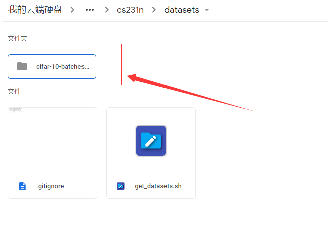

# Colab之作业完整部署

## 1.总语

这里讲上传文件至你的google driver，这样做的好处是不需要每次去下载，方便操作！！！可以长久保存编辑的文件，所以推荐这个方法！！！

下面一起来看如何使用吧！

## 2.下载及上传

首先我们到官网下载任务：http://cs231n.github.io/assignments2018/assignment1/


下载下来是个压缩包，请解压，然后上传至你的google driver!

上传后可以在你的google driver里面看到相应的额文件夹！


## 3.准备工作

我们进入任务文件夹，找到knn.ipynb完成我们的第一个作业，首先用colab打开！


紧接着，在打开的knn.ipynb文件开头加上，授权验证代码及创建drive目录代码，以及下载数据集代码等！

> 授权

让colab能够访问到我们google driver里面的文件，必须授权！

```
# 授权验证
!apt-get install -y -qq software-properties-common python-software-properties module-init-tools
!wget https://launchpad.net/~alessandro-strada/+archive/ubuntu/google-drive-ocamlfuse-beta/+build/15331130/+files/google-drive-ocamlfuse_0.7.0-0ubuntu1_amd64.deb
!dpkg -i google-drive-ocamlfuse_0.7.0-0ubuntu1_amd64.deb
!apt-get install -f
!apt-get -y install -qq fuse
from google.colab import auth
auth.authenticate_user()
from oauth2client.client import GoogleCredentials
creds = GoogleCredentials.get_application_default()
import getpass
!google-drive-ocamlfuse -headless -id={creds.client_id} -secret={creds.client_secret} < /dev/null 2>&1 | grep URL
vcode = getpass.getpass()
!echo {vcode} | google-drive-ocamlfuse -headless -id={creds.client_id} -secret={creds.client_secret}
```

> 创建drive目录

指定根目录！

```
# 指定Google Drive云端硬盘的根目录，名为drive
!mkdir -p drive
!google-drive-ocamlfuse drive
```

> 下载CIFAR-10数据集

首先进入assignment1目录：

这个目录根据你的情况来修改！！！可以一步一步的cd ls来查看！，然后开头都是、content/drive/ 后面的根据情况改！！！

```
cd /content/drive/drive/colab_learn/assignment1
```

紧接执行下面这个命令，然后下载数据集！

```
!cd ./cs231n/datasets && bash get_datasets.sh && ls
```

如下图所示：


打开google driver，进入到任务里面cs231n->datasets下面会发现多了个数据集，这个就是刚才下载的，说明正确，当然你也可以本地下载好，直接上传，这一步直接跳过即可！



## 4.开始实战

> 切换路径

返回我们的任务数据集目录，或许你跟我的不一样，但是开头/content/drive 与结尾的asssignment1都一样！至于中间是什么，根据你在google driver的目录来配置，我是在根目录下创建了一个colab_learn文件夹，然后将任务放在这里面！自己修改一下即可！！！

```
cd /content/drive/drive/colab_learn/assignment1/
```

然后开始运行knn.ipynb第一行代码，看是否报错!

如果报错，如下图：

则说明是路径问题，此时你需要运行!ls查看当前目录是否在assignment1目录，如果不在，肯定会报错的，所以你进入到这个目录里面才可以，也就是上面cd命令一定要检查是否正确！


如果正常的话，说明knn数据集下载正确，并且路径正确，那么我们只需要完成作业即可！

> 完成任务

要完成knn这个作业，那么我们需要对k_nearest_neighbor.py文件进行编辑，完善代码，下面给出如何在线编辑与修改！

右键这个文件，使用第二个打开，当然你也可以使用其他的！


然后会看到如下界面：

完善你的代码，快捷键ctrl+s保存或者左上角保存即可！


然后我们进入我们的knn.ipynb文件里面，继续完善代码，最终运行结果如下：


到这里，就说明任务knn完成了，那么怎么下载下来，发送邮件到指定邮箱呢？

> 下载文件

上面knn.ipynb任务完成后，一定要保存，然后进入google driver里面下载assignment1即可！最后就是发邮件~~


到这里一个完整的任务流程介绍完毕了，欢迎各位同学，尽快完成作业，发送指定邮箱！


