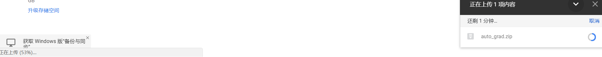
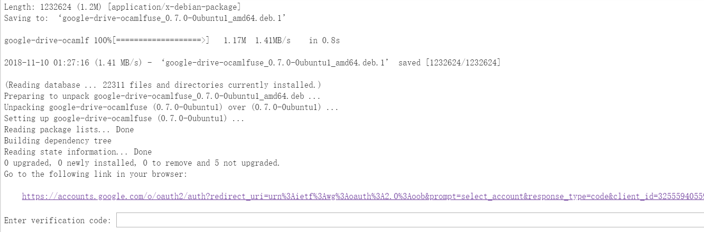

# colab使用


## 0.说在前面

Colaboratory 是一个研究项目，可免费使用。并且提供**免费GPU！**

Colaboratory 是一个 Google 研究项目，旨在帮助传播机器学习培训和研究成果。它是一个 Jupyter 笔记本环境，不需要进行任何设置就可以使用，并且完全在云端运行。
Colaboratory 支持**在线安装包以及linux命令等操作**。

有一点非常重要：它与**google driver**绑定！每次启动，会为用户分配一个新的内存空间，如果说你想要长期使用，必须上传文件至你的google driver，接下来一起来研究如何持久化使用**google driver**!

**colab**

> colab:
>
> https://colab.research.google.com/

**google driver**

> google driver
>
> https://drive.google.com/drive

## 1.google driver

研究colab之前，了解一下google driver基本操作，首先来看如何上传文件及其他基本操作！

> 基本操作

打开上述googl driver官网，进去就可以看到这个页面，然后空白处点击右键就会出现创建文档与上传文档操作，只需要点击右键即可完成这个上传操作(或者其他操作)！


我们以某文件上传完为例，如何查看数据上传进度？

右键上传后，左下角有显示进度百分比~~~，等到百分之百即可完成上传操作！



## 2.colab使用

最最关键的是授权，每次打开colab之前下载的资料都不存在了，怎么办？

解决办法就是将文件上传的到你的google driver，然后在colab中读取即可！

下面来引入脚本来执行每次从google driver导入到colab的操作！

> 授权

下面的`apt-get`是相关的linux命令！

其余的import为python的导包命令！

```python
!apt-get install -y -qq software-properties-common python-software-properties module-init-tools
!wget https://launchpad.net/~alessandro-strada/+archive/ubuntu/google-drive-ocamlfuse-beta/+build/15331130/+files/google-drive-ocamlfuse_0.7.0-0ubuntu1_amd64.deb
!dpkg -i google-drive-ocamlfuse_0.7.0-0ubuntu1_amd64.deb
!apt-get install -f
!apt-get -y install -qq fuse
from google.colab import auth
auth.authenticate_user()
from oauth2client.client import GoogleCredentials
creds = GoogleCredentials.get_application_default()
import getpass
!google-drive-ocamlfuse -headless -id={creds.client_id} -secret={creds.client_secret} < /dev/null 2>&1 | grep URL
vcode = getpass.getpass()
!echo {vcode} | google-drive-ocamlfuse -headless -id={creds.client_id} -secret={creds.client_secret}
```

> 授权

运行上述代码后，会有两次授权，下面是授权过程~~



点击上述的授权url，然后进入下面授权页面：


点击上述你的账户，如果没有登录谷歌账号，请注册后再登录即可，然后会进入下面授权代码，复制这一串授权代码。


粘贴到上述的授权窗口里面，回车即可，会操作两次~~


## 3.访问文件

如何验证我们可以访问google driver文件？

**指定Google Drive云端硬盘的根目录，名为drive**

```python
!mkdir -p drive
!google-drive-ocamlfuse drive
```

接下来就是linux命令，不过在这里面命令前面得加个`!`

例如：

```python
!ls
```

然后cd进入你的文件夹里面即可~

### One More Thing

相信通过上面这些内容你已经学会了如何使用colab，下一章我们会示例如何在colab上完成cs231n的作业

to be continued ...


