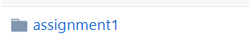

# CV作业提交流程

## 1.查看作业

- 学习及任务地址：

> https://github.com/sharedeeply/cs231n-camp

- 作业位置如下图：

- 进入对应作业文件夹

这里以**assignment1**为例：

点击相应任务，查看作业：

阅读任务readme，按照要求完成作业

## 2.开始任务

按照readme下载输入相应命令，下载数据集！

下载完成后，它会自动解压包，并生成数据集文件夹！

上面的cifar....便是数据集！

后面便是实现作业要求！

## 3.作业提交

【**删除数据集**】

上述数据下载后在datasets文件夹下，完成作业后，请删除掉datasets整个文件夹！并打包任务文件夹

【**找到自己对应营期的CV学号**】
[CV一期训练营](https://shimo.im/sheet/O1GxWoA41j4kW3Sg/787b4/)
[CV二期训练营](https://shimo.im/sheet/yPhRjSQ4284NyeZo/c46b5/)
[CV三期训练营](https://shimo.im/sheet/jijhhvgGEJM5DkTk/08d81/)

【**作业打包**】

将完成的作业改名为“**训练营期数-学号-作业编号**”，例如："**一期-CV0001-assignment1**"，然后压缩成 **zip** 文件!

**找到任务文件夹**

重命名为**一期-CV0001-assignment1**

**也按照上述命名要求打包！**

**最终结果**

注意点：一定要命名正确，并且为zip文件，检查自己的学号是否正确！！！

在提交作业之前需要删掉下载的数据，上传的 zip 文件大小不要超过 20M！！！

注意不要改变作业中的《类名》和 《函数名》不然会检测失败！！

【**上传**】

将上述的zip文件发至下面公共邮箱即可！！！

训练营代码公共邮箱：[cs231n@163.com](mailto:cs231n@163.com)

